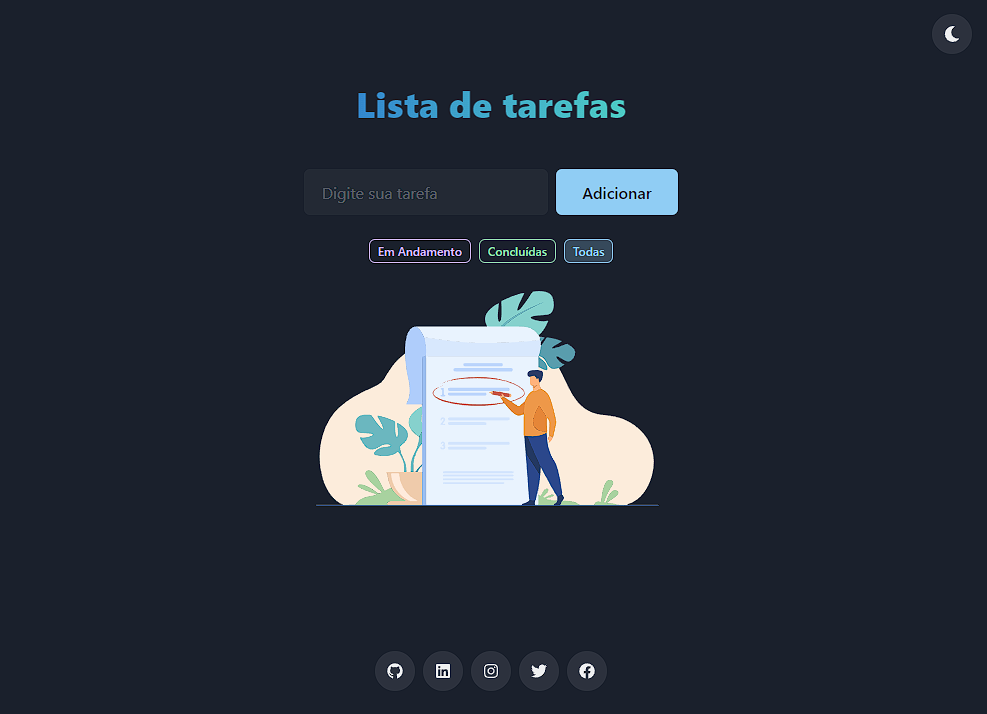

[](https://app.netlify.com/sites/iridescent-praline-f9b50f/deploys)

# Todo React TS Redux

[](https://nodejs.org/en/) [](https://www.typescriptlang.org/) [](https://pt-br.reactjs.org/) [](https://redux.js.org/) [](https://chakra-ui.com/) [](https://react-icons.github.io/react-icons/)

 Uma lista de tarefas simples utilizando algumas das tecnologias mais recentes!

**[CLIQUE AQUI](https://todo.foxtag.com.br/)** para testar (by Vercel)!

 <p align="center">
  <a src="#" target="_blank"></a>
</p>

## 👊🏻 Thanks before you start

This project was created using as a base, 2 distinct projects, being:

+ <https://github.com/raminhuk/react-todo-list>
+ <https://github.com/abdulsamadayoade/redux-todo>

Using the REDUX structure from the **redux-todo** project and the REACT layout and structure from the **react-todo-list** project, I just converted the projects to Typescript with the help of Vite and unified them into one.

## ❓ Project purpose

I put this project together just to study, I hope that as the above projects helped me, this project can help you too :)

## ⚠️ Warning

In the DevTools console, the project shows an incompatibility message with the React.render feature in React version 18, the problem is caused by the Chakra UI **Toast** and the framework developers are already aware of it.

## 🚀 Let's get started?

If you want to test this project, follow the steps below!

+ First clone this repository

```jsx
git clone https://github.com/linhous/todo-ts-redux.git
```

+ Go into the all-ts-redux folder

```jsx
cd all-ts-redux
```

+ Run npm install to install the dependencies

```jsx
npm install
```

+ Run npm run dev to run the project at <http://localhost:3000/>

```jsx
npm start
```

+ If you want to build the project

```jsx
npm run build

Translated with www.DeepL.com/Translator (free version)
